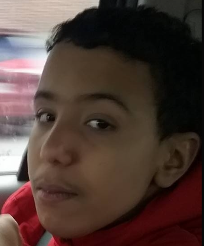
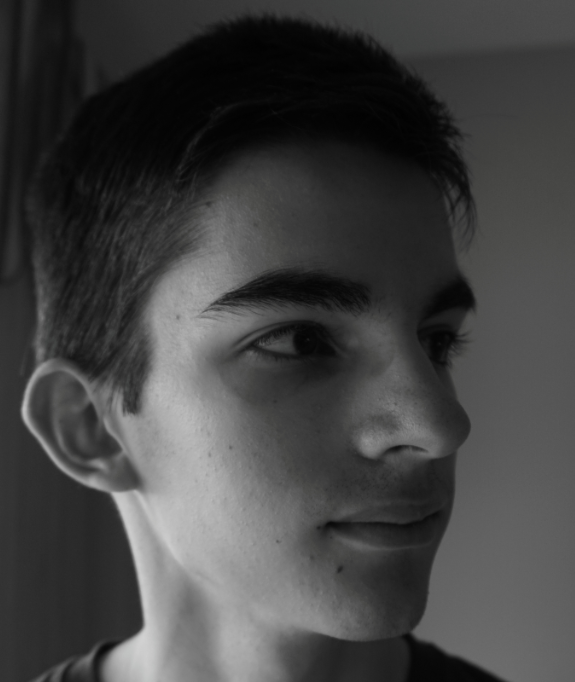
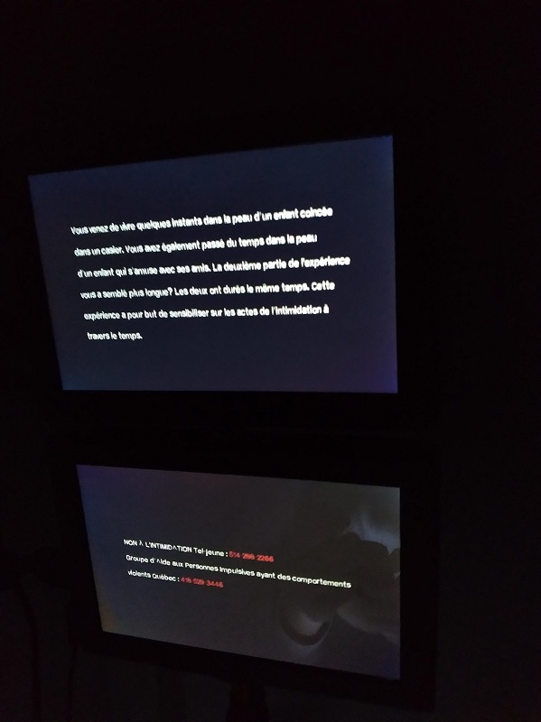
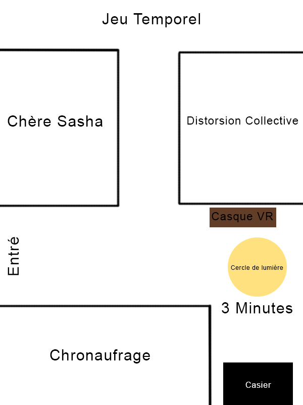
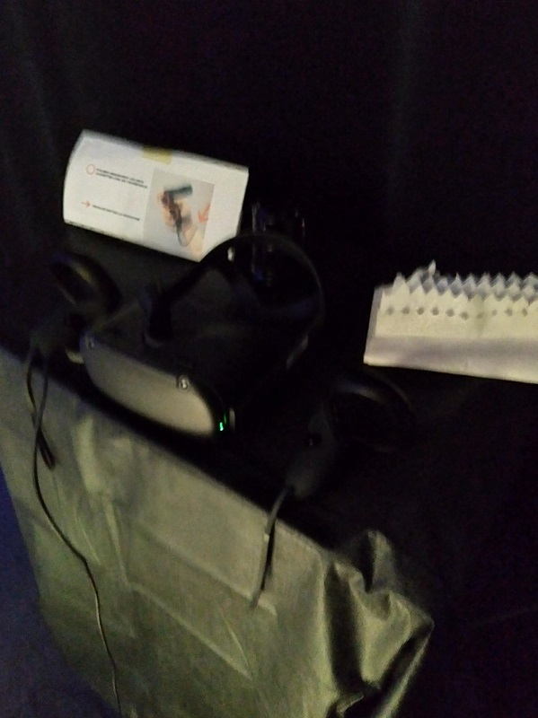
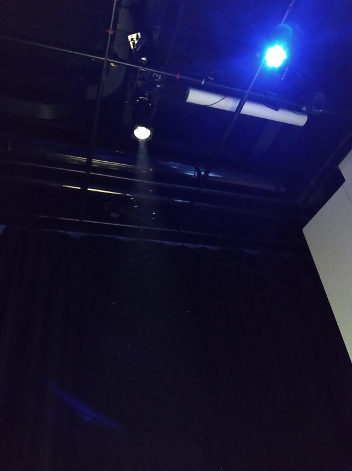
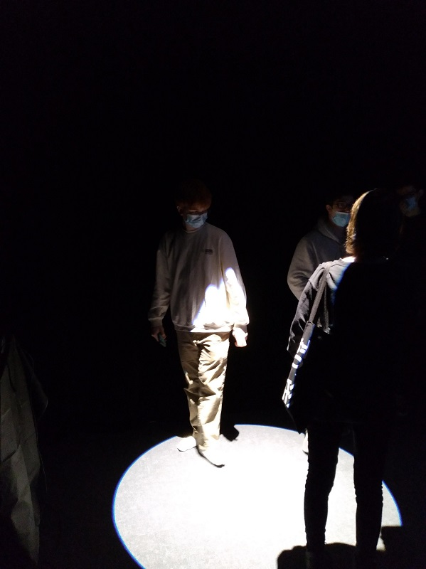
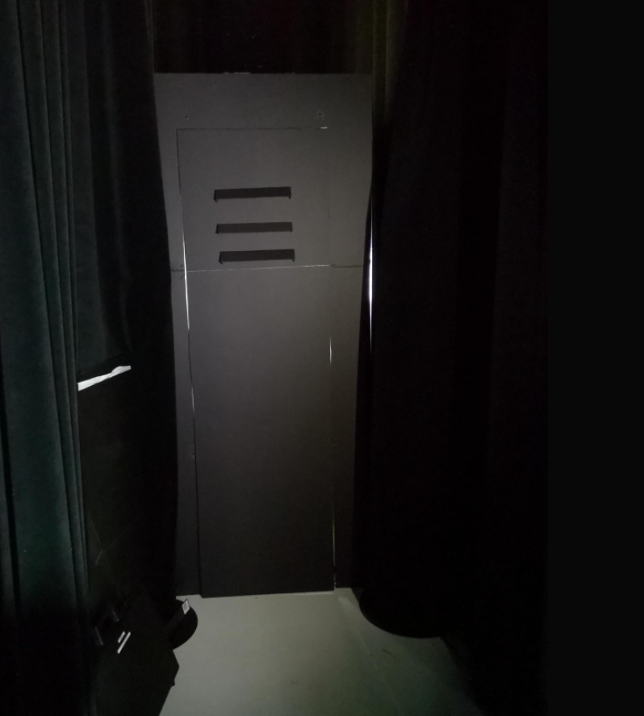

# Titre de l'oeuvre ou de la réalisation
## 3 Minutes

# Nom de l'artiste
## Naoufal Bensaiad, Jérémie Lévesque et Samuel Poulin

# Année de réalisation
## 2021

# Nom de l'exposition
## Tim MOEBIUS

# Lieu de mise en exposition
## Collège Montmorency

# Date de notre visite
## 2022/03/24

# Description de l'oeuvre ou du dispositif multimédia
## Nous arrivons sous un cercle de lumière, à notre gauche, il y a un casque de réalité virtuelle sur une table. Lorsque nous mettons le casque, nous nous retrouvons dans un gymnase et le but est de toucher le plus de cible possible avec des ballons en 3 minutes. Une fois les 3 minutes écoulées, nous déposons le casque et nous dirigeons vers un petit couloir où il y a un casier. Vous entrez dans le casier et y rester pendant 3 minutes. Durant les 3 minutes dans le casier, des sons de ballons et d'enfant serons entendu à l'extérieur du casier.

# Explications sur la mise en espace de l'oeuvre ou du dispositif
## L'oeuvre est situer en face de la porte d'entrée du studio juste à côté de Chronaufrage.

# Listes des composantes et techniques de l'oeuvre ou du dispositif
## Un ordinateur, un casque de réalité virtuelle, des capteurs de mouvements, un projecteur de lumière et des haut-parleurs.

# Liste des éléments nécessaires pour la mise en exposition
## Les éléments nécessaires sont un couloir, un plafond assez haut, une prise d'alimentation et un ordinateur pour faire fonctionner le jeu dans le casque de réalité virtuelle.

# Expérience vécue
## J'ai trouvé la façon dont ils démontraient le temps dans leur œuvre assez intéressante. Ils font passer un message sur l'intimidation dans leur projet ce que je trouve vraiment géniale, car elle démontre vraiment les impacts que les gens qui se font intimider ressentent.

# Description de mon expérience de l'oeuvre ou du dispositif, de l'intéractivité, des gestes à poser
## Nous arrivons sous une lumière et nous devons prendre un casque de réalité virtuelle posé sur une table à notre gauche. Une fois le jeu des ballons terminés, nous nous dirigeons dans un petit couloir sombre et pénétrons dans un petit casier. Une fois les 3 minutes dans le casier écoulé, un message audio vous demandera de quitter le casier.

# Ce qui m'a plu, vous a donné des idées et justifications
## Je trouve que cette oeuvre était celle qui démontrait le plus la contrainte du temps. J'ai adorer l'idée de nous faire participer à deux activitées ayant la même durée pour nous démontrer que le temps passe plus vite lorsque nous somme heureux et plus lentement lorsque nous sommes malheureux.

# Aspect que je souhaiterais faire autrement ou ce que je changerais
Je crois que la seule chose qui serait à changer serait de donner la feuille d'instruction au début, car le jeu peut être assez confus.

# Mon classement des oeuvres 

## 1: 3 Minutes
## 3 Minutes est monté en première place à cause de son interactivité et de son originalité. C'est l'œuvre que j'ai le plus apprécié de toute celle qui était présentée. J'ai aussi beaucoup aimé la façon dont ils représentent le temps dans leur œuvre.

## 2: L'horloge de l'apocalypse
## L'Horloge de l'apocalypse est resté en deuxième position, car l'œuvre fonctionnait exactement de la façon décrite. J'ai adoré l'idée de pouvoir changer de période du temps grâce aux aiguilles d'une horloge. Le changement des périodes du temps était rapide et fluide ce qui était agréable.

## 3: Chère Sasha
## Chère Sasha est monté en troisième position, car l'histoire et la mise en place étaient beaucoup plus intéressantes que je l'aurais pensé. Au départ, je ne voyais pas vraiment quelque chose d'incroyable, mais lorsque je l'ai vécu, ma perception de l'œuvre a totalement changer.

## 4: Jeu Temporel
## Jeu temporel est monté en quatrième position grâce à son interactivité. La façon dont le quiz était fait l'a rendu plus unique que la plupart des quiz. La façon dont l'œuvre était exposer était vraiment super, je trouve que ça lui donnait du style et plus de vie.

## 5: Chronaufrage
## Chronaufrage est descendu en cinquième position, car l'œuvre n'avait pas beaucoup d'aspect interactif en comparaison avec les autres œuvres. L'œuvre était incroyable visuellement.   

## 6: Distorsion collective
## Distortion collective est selon moi l'œuvre la moins intéressante de toute les œuvres exposé. Il n'y avait aucune interactivité et l'œuvre était quand même longue à faire. Son manque d'interactivité l'a placé en dernière position. Le message porté par l'œuvre était très impactant ce qui m'a agréablement surpris.

source: https://tim-montmorency.com/2022/projets/3-minutes/docs/web/index.html
