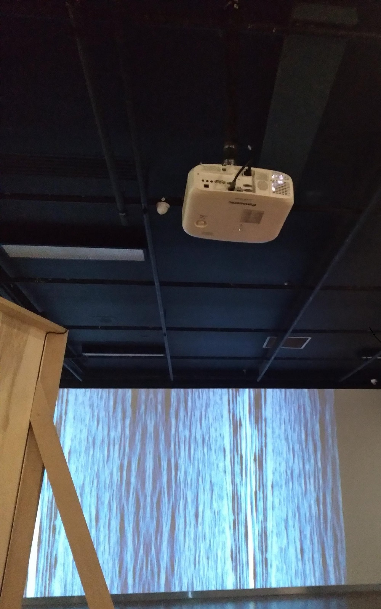

# Titre de l'oeuvre ou de la réalisation
## Le fleuve, 50°11'53,8"N.,66°4'10"O.

# Nom de l'artiste
## Catherine Béchard et Sabin Hudon.

# Année de réalisation
## L'oeuvre à été réaliser en 2021

# Nom de l'exposition
## Configuration Sensible

# Lieu de mise en exposition
## Maison des arts de Laval.

# Date de notre visite
## 2022-03-17

# Description de l'oeuvre ou du dispositif multimédia
Les images dédoubler qui sont présente sur la vidéo ont été tourner à la Pointe de Moisie. La vidéo est hyptnotique et le paysage se mélange parfaitement avec les sons marins de L'en deçà.

# Explications sur la mise en espace de l'oeuvre ou du dispositif
L'oeuvre est située derrière l'oeuvre L'en deçà dans le coin droit de la pièce. 

# Listes des composantes et techniques de l'oeuvre ou du dispositif
Un projecteur, un ordinateur et la vidéo de l'oeuvre.

# Liste des éléments nécessaires pour la mise en exposition
Les éléments nécessaires sont un mur, une source d'alimentation et un ordinateur qui va projeter la vidéo par un projecteur.

# Expérience vécue
J'ai trouver l'oeuvre hypnotisante et relaxante. Lorsque nous sommes arrivés devant l'oeuvre, j'ai tout de suite compris ce que L'en deçà qui était situer juste derrière se mélangeais avec Le fleuve.

# Description de mon expérience de l'oeuvre ou du dispositif, de l'intéractivité, des gestes à poser
La seul chose qu'il y avait à faire avec cette oeuvre c'était de la contempler.

# Ce qui m'a plu, vous a donné des idées et justifications
J'ai beaucoup aimer l'idée de relier Le fleuve et L'en deçà comme ils l'ont fait. Selon moi c'était une idée brillante car ce n'est pas quelque chose que l'ont voit souvent dans des expositions d'art et c'est ce qui selon moi rend cette oeuvre unique.

# Aspect que je souhaiterais faire autrement ou ce que je changerais
J'aurais aimer qu'il y ai peut-être de l'intéractivité à l'oeuvre pour rendre l'expérience encore plus passionante qu'elle l'était déjà.
