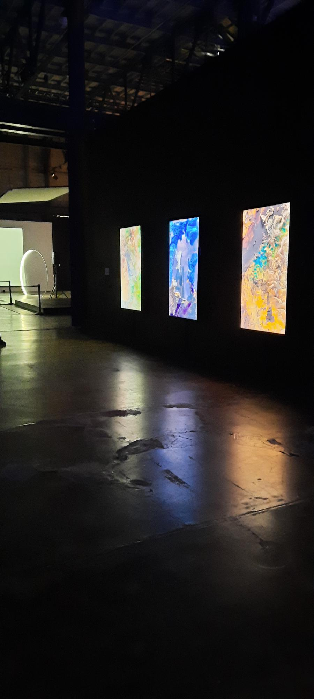

## Titre de l'oeuvre ou de la réalisation

L'oeuvre est séparée en trois parties. La première oeuvre se nomme Space Dreams, la deuxième Urban Dreams et la dernière Nature Dreams. Les trois oeuvres ensemble se nomme Dreams.
## Nom de l'artiste

Le nom de l'artiste est Refik Anadol.
## Année de réalisation

L'oeuvre à été réaliser en 2020.
## Nom de l'exposition

METAMORPHOSIS ART NUMÉRIQUE & IMMERSIF
## Lieu de mise en exposition

Le lieu de mise en exposition est l'Arsenal art contemporain.
## Date de notre visite

Le jeudi 10 février 2022.
## Description de l'oeuvre ou du dispositif multimédia

L'oeuvre Dreams utilise des images des milliers d'images pour créer une expérience unique et hors du commun. L'oeuvre space Dreams utilise des images capturées a partir de la Station spatiale internationale. L'oeuvre Nature Dreams utilise plus de 69 millions d'images de parcs nationaux, de l'Islande et d'autres merveilles naturelles.(source : Fiche descriptive de l'oeuvre à la METAMORPHOSIS ART NUMÉRIQUE & IMMERSIF)      
## Explications sur la mise en espace de l'oeuvre ou du dispositif

L'oeuvre est situé sur le mur gauche du couloir, à droite il y a des sièges pour s'asseoir et le milieu du couloir sert à circuler.
## Listes des composantes et techniques de l'oeuvre ou du dispositif

Un téléviseur aves une résolution Ultra Haute Définition(4k), des câble d'alimentation, des câble permettant l'affichage d'une résolution Ultra Haute Définition(4k)  
## Liste des éléments nécessaires pour la mise en exposition

Les éléments qui sont nécessaires pour la mise en exposition de l'oeuvre sont un mur, une source d'alimentation et un ordinateur qui va envoyer les images au téléviseur.
## Expérience vécue

J'ai trouver l'oeuvre relaxante et intriguante à la fois. Au départ je ne comprenias pas bien ce que nous étions supposer voir mais, en allant lire la fiche descriptive j'ai compris ce que l'oeuvre représentait et comment elle le fesait. Selon c'était l'oeuvre la plus jolie de toute l'exposition.
## Description de mon expérience de l'oeuvre ou du dispositif, de l'intéractivité, des gestes à poser

La seul chose à faire avec cette oeuvre c'est de s'asseoir et de contempler les différentes images qui défile.
## Ce qui m'a plu, vous a donné des idées et justifications

J'ai adoré l'idée de prendre des images et de les fusioner en temps réel ce qui crée un effet de déconstruction. Cela ma donner l'idée de faire une oeuvre numérique en 3D qui reprendrait l'idée de l'oeuvre Dreams c'est à dire fusioner des éléments et les déconstruires. Cette oeuvre en 3D fouillerait dans un répertoire de forme en 3D et les mélanges pour ensuite les faire disparaître sous forme de pixels.
## Aspect que je souhaiterais faire autrement ou ce que je changerais

J'aurais aimer que l'oeuvre soit un peu plus grosse et qu'elle soit plus espacé.

