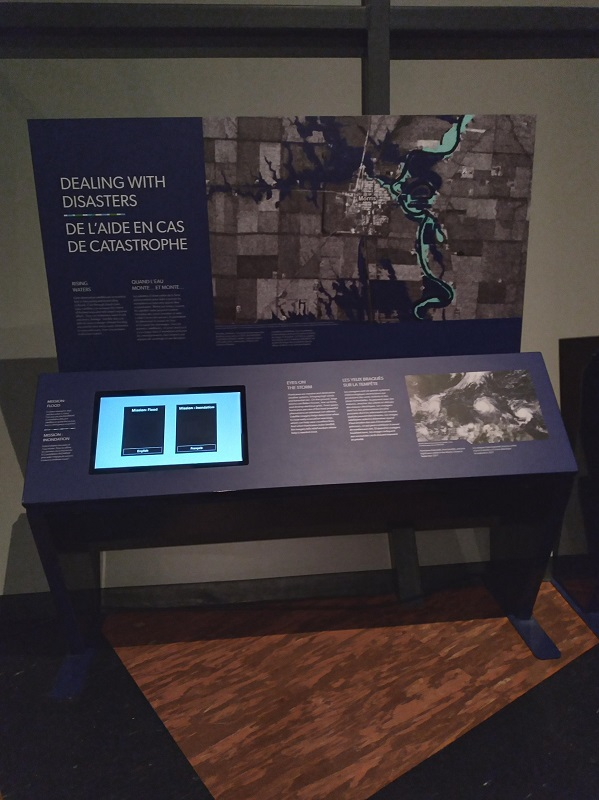
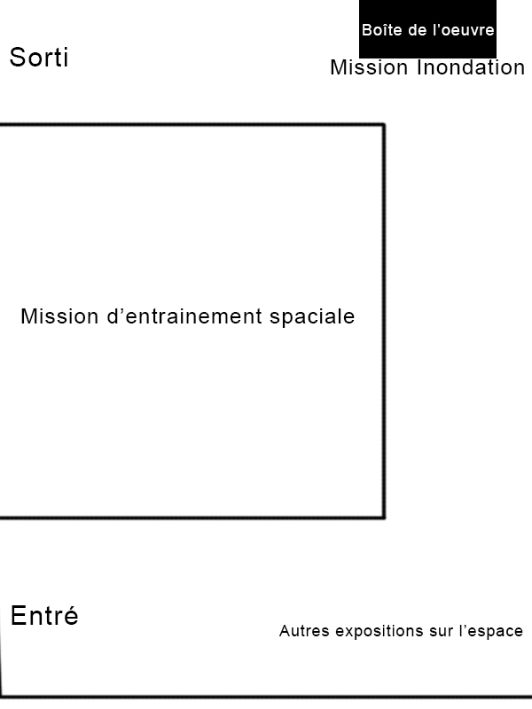
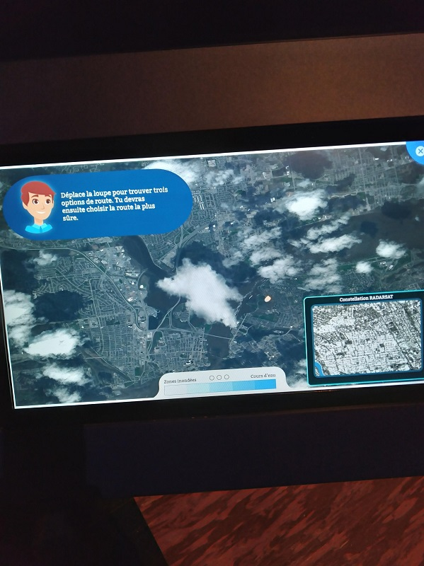
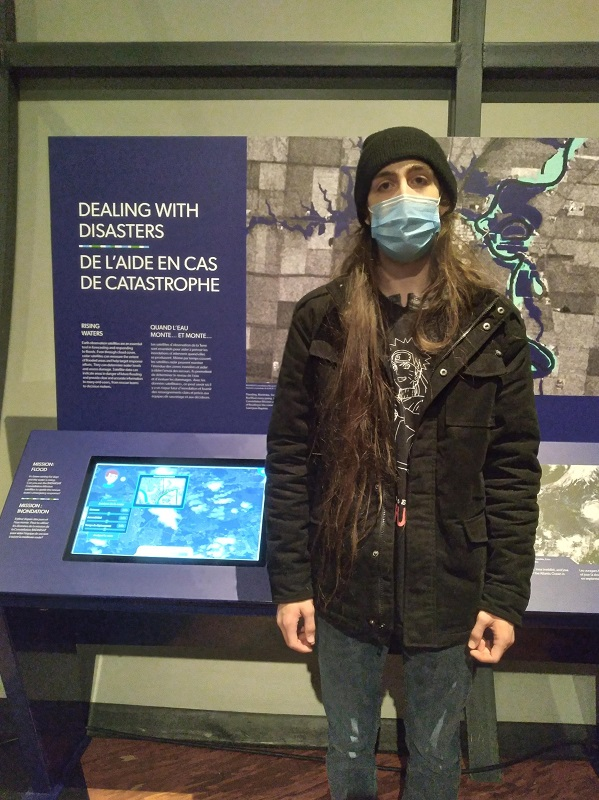

# Titre de l'oeuvre ou de la réalisation
## De l'aide en cas de catastrophe: Mission inondation 

# Nom de l'artiste
## L'artiste n'est pas mentionner

# Année de réalisation
## l'année de réalisation n'est pas mentionner

# Nom de l'exposition
## Aucun nom d'exposition n'est mentionner

# Lieu de mise en exposition
## Le cosmodome

# Date de notre visite
## 2022/04/03

# Description de l'oeuvre ou du dispositif multimédia
## Ils y a des inondations et les secours doivent se déplacer et nous devons donc trouver la meilleure route possible sur les données qui nous sont fournies. (source la fiche descriptive de l'œuvre)

# Explications sur la mise en espace de l'oeuvre ou du dispositif(texte à composer)
## Lorsque vous avez terminé de visiter le cosmodome, vous suivez un couloir vers la sortie et au fond de ce couloir se trouve l'œuvre parmi les autres œuvres.

# Listes des composantes et techniques de l'oeuvre ou du dispositif
## Un écran tactile, une boite de bois,un micro-ordinateur.

# Liste des éléments nécessaires pour la mise en exposition
## Une source d'alimentation, un espace assez grand pour accueillir la boite et un ordinateur qui va gerer le logiciel de la mission.

# Expérience vécue
## J'ai trouvé que cette œuvre était la plus intéressante parmi celle présente, car elle touchait des problèmes récent qui ont été tragique. J'étais curieux de savoir comment ils faisaient pour trouver des routes sans danger lors de situation comme celle-là. 

# Description de mon expérience de l'oeuvre ou du dispositif, de l'intéractivité, des gestes à poser
## Nous sommes arrivées devant l'œuvre et nous avons sélectionner la langue que nous voulions utiliser. Ensuite, nous avons sélectionné les routes qui étaient les plus courtes et il y avait des explications de la part d'un personnage dans une bulle. 

# Ce qui m'a plu, vous a donné des idées et justifications
## J'ai bien aimé l'aspect d'interactivité dans l'œuvre. Le fait de nous faire réfléchir lors de l'utilisation de l'œuvre est plus agréable, car cela nous force à réfléchir sur ce que nous devons faire.

# Aspect que je souhaiterais faire autrement ou ce que je changerais
## La seule chose que je changerais est l'emplacement de l'oeuvre, car elle est située à la fin de la visite ce qui selon moins n'est pas le meilleur endroit où mettre une œuvre.

source: Cosmodome
